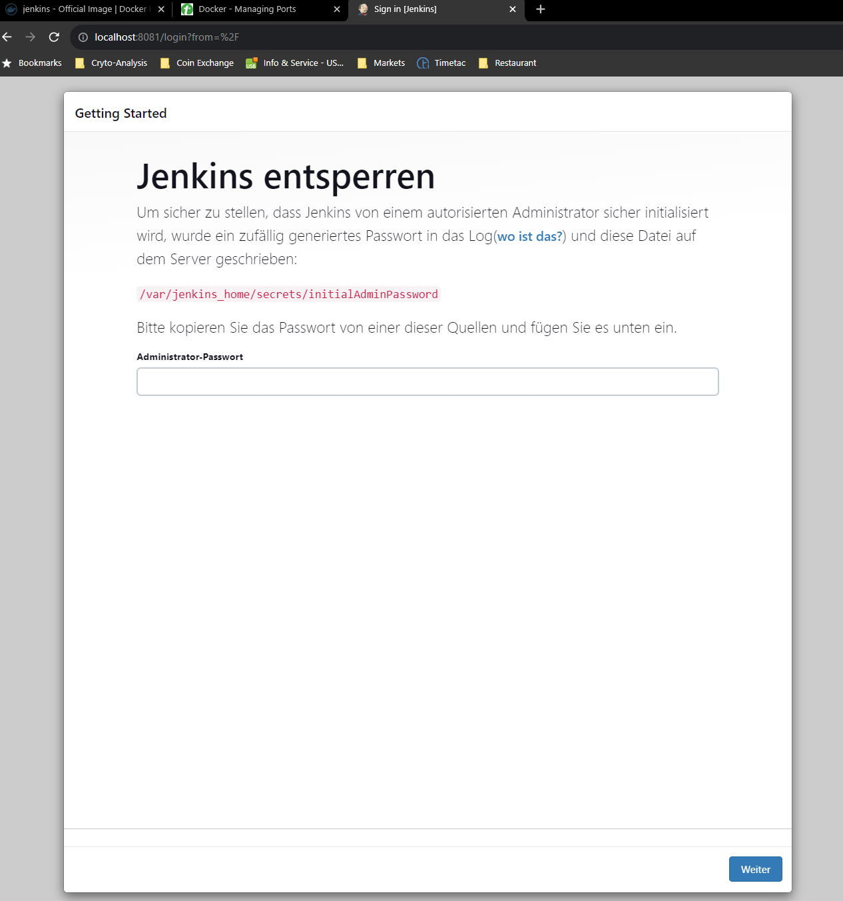
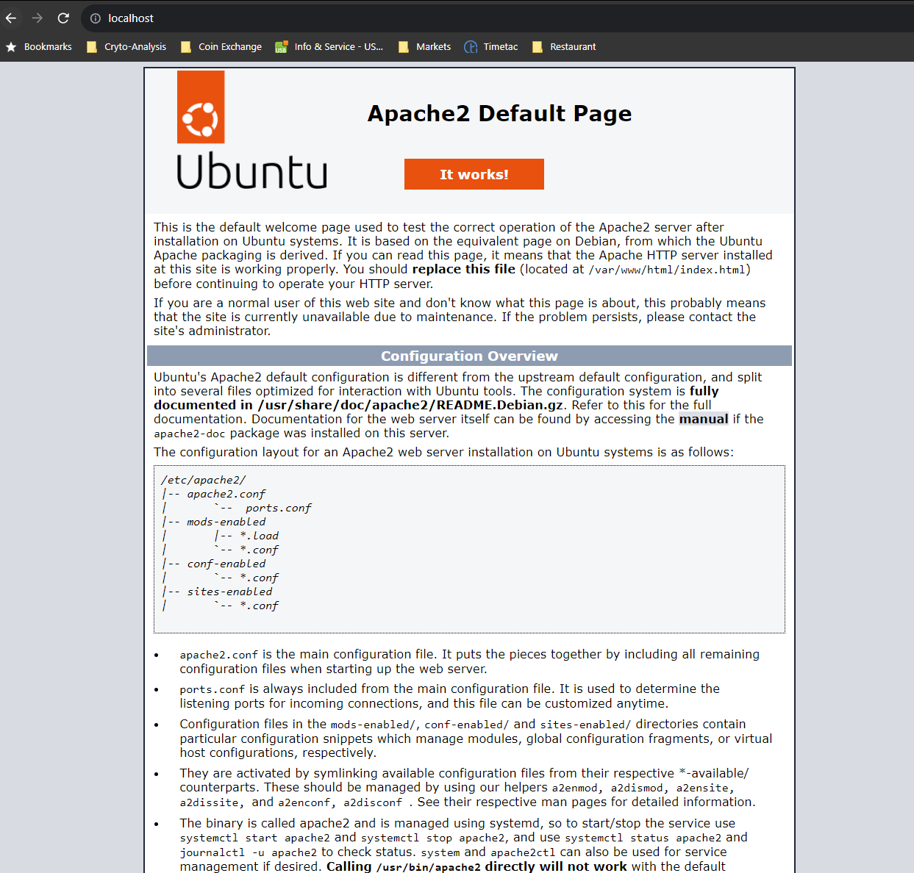

# Docker Tutorial

## Overview
 - The keywords of docker are develop, ship and run. The whole idea of Docker is for developers to develop applications, ship them into containers whcich can then be deployed anywhere.
 - lightweiht and scalable
 - deploy docker container anywhere, on any physical and virtual machines and even on cloud
 
 ## Components of Dockers
 - Docker for Mac - to run docker containers on Mac OS
 - Docker for Linux - to run docker containers on Linux OS
 - Docker for Windows - to run docker containers on Windows OS
 - Docker Engine - to build docker images and create docker containers
 - Docker Hub - this is registry to host various docker images
 - Docker Compose - to degine applications using multiple Docker containers
 
 ## Instation of Docker on Windows
 
 - install docker for Windows: download docker desktop and install it
 - install docker toolbox: Windows 10 Home you must use Docker Toolbox. Windows 10 Pro or Enterprise you can and is recommended running Docker for Windows
 - to test if the docker is installed correctly:
 ```
 docker run --help
 docker run hello-world
 ```
 
 ## Docker Hub
 - this is a registry service on the cloud that allows you to download docker images that are builts by other communities. 
 - we will leatn how to download and use the Jenkins Docker image from Docker hub
 
 ```
 docker pull jenkins/jenkins
 docker run -p 8080:8080 -p 50000:50000 --restart=on-failure jenkins/jenkins
 ```
 
 ## Docker image
 docker images : to list of installed docker images
 docker run centos: download and run docker image if it is not present
 docker rmi ImageID: to remove a docker image. to idetify the image id use the command: docker images
 docker rmi -f ImageID: force to delete image
 
 ## Docker Container
 
Container are instances of Docker images.
Docker un is to run a container.

to run a container in an inactive mode:
```
docker run -it centos /bin/bash
then hit Ctrl+p and you will return to OS Shell.
```

to list of Container:
```
docker ps
docker ps -a
docker history ImageID 
docker history centos
```

to stop a container
```
docker stop ContainerID
```

other command
```
docker rm ContainerID : to delete a container
docker rm 9f215ed0b0d3 : example to delete container
docker stats ContainerID : show stat of a container
docker pause ContainerID : to pause a continer
docker unpause ContainerID: to unpause a container
docker kill ContainerID: to kill the processes in a running container
```

## Docker File and docker build

e.g. Dockerfile
```
#This is a sample Image 
#This is a sample Image 
FROM ubuntu 
MAINTAINER minhducngo85@gmail.com 

RUN apt-get update
#RUN apt-get install nginx
CMD [“echo”,”Image created”] 
```

## docker build
Syntax: **docker build  -t ImageName:TagName dir
Options:

**-t** − is to mention a tag to the image
**ImageName** − This is the name you want to give to your image.
**TagName** − This is the tag you want to give to your image.
**Dir** − The directory where the Docker File is present.


e.g. 
**docker build -t mydockerimage:0.1 .** - to build docker image with the Dockerfile above
**docker images** -  to list of images

to run created image:
**docker run -it myimage:0.1 /bin/bash**

## docker managing ports
Some application in Docker runs on ports. You need to map the port pf the container to the port of the dockert host.
Let's look at an example of how this can be achieved.
In our example, we will donwload Jenkins container from Docker hub and map the Jenkins port to the port on the ducker hub.

Step 1: open Docker hub and find the Jenkisn image
Step 2: docker pull jenkins/jenkins:lts
Step 6: docker inspect to understand what ports are exposed by the container.
Syntax:
```
docker inspect image
docker run -p hostPort:containerPort image
```

e.g.:  expose ports and run command
``` 
docker inspect jenkins/jenkins
docker run -p 8081:8080 50001:50000 jenkins/jenkins
let open web browser and enter localhost:8081
```


## Private registries (private repositories)

``` 
docker run -d -p 5000:5000 --name registry registry:2
docker ps
docker tag registry:2 localhost:5000/centos
docker push localhost:5000/centos

delete the created container and pull download it again from localhost
docker rmi --force 0030ba3d620c
docker pull localhost:5000/centos:latest
``` 


## Building webserver from docker File

Step 1: create dockerfile
``` 
FROM ubuntu
RUN apt-get update -y
RUN apt-get install -y apache2
RUN apt-get install apache2-utils
RUN apt-get clean
EXPOSE 80
CMD ["apache2ctl", "-D", "FOREGROUND"]
``` 
- create ad ubuntu image and install apache package
- expose port 80 in the docker container to the docker host
- finally, run the apache2 in the background

Step 2: build docker file and tag image as "mywebserver"
``` 
docker build -t mywebserver:0.1 .

if you get an error please try wth option --no-cache

docker build --no-cache -t mywebserver:0.1 .
```

Step 3: run & aopen werbrwoser at localhost:80
```
docker run -d -p 80:80 mywebserver:0.1
```


## Instructions commands

### CMD Instruction
to execute a command at runtime
```
CMD command param1 

e.g.
CMD ["echo", "Hello world"]
```

### entrypoint: like the CMD command but we cann pass the param from ducker run
syntax:
ENTRYPOINT command param1 

e.g.

step 1: Dockerfile:

FROM ubuntu 
MAINTAINER minhducngo85@gmail.com 
ENTRYPOINT [“echo”]

Step 2: docker build
docker build -t="entrypointdemo" .

step 3: run
docker run entrypointdemo Hello World

### ENV
to set the environment variables in the containers
Synteax: ENV key value

### WORKDIR
to set the working directory of the container

## Container linking
container linking allow multiple container to link with each other. It is better option to expose ports-

Step 1:<br/>
docker run --name=jenkinsa -d jenkins/jenkins

Step 2:<br/>
docker run --name=reca --link=jenkinsa:alias-src -it ubuntu:latest /bin/bash

Step 3:<br/>
docker attach reca

Step 4:<br/>
env